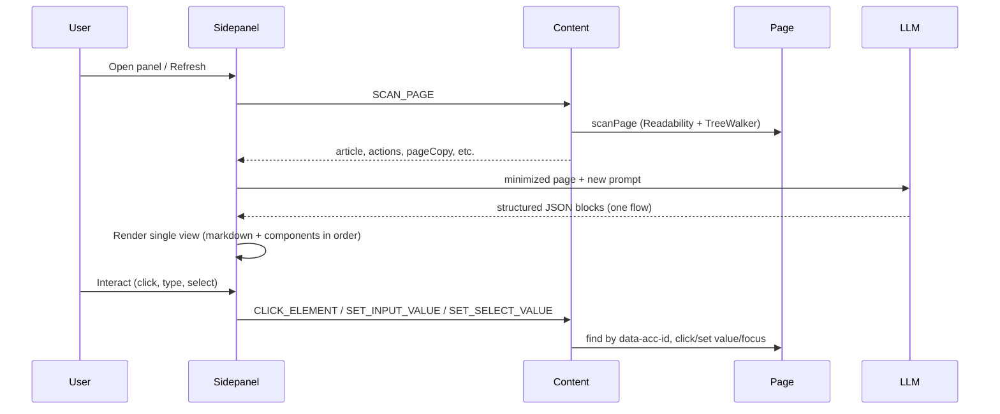

# LLM-driven structured sidebar for accessibility (updated)

## Overview

Evolve the existing Klaro extension so the sidebar is driven by an LLM that returns a structured JSON list of markdown passages and interactive components (buttons, inputs, selects, links). Pre-built sidebar components render this list and forward user interactions to the original page via the content script. **The sidepanel has a single view** that combines reading and interactions in one easy-to-understand flow (no separate Read / Accessible tabs).

## Sidepanel: single combined view

- **Remove** the current tabbed UI (Read vs Accessible). There is **one view only**.
- The sidebar shows a **single, linear flow**: markdown passages and interactive components interleaved in the order returned by the LLM. This makes it easy to understand: “Here’s what this page is about” (markdown) followed by “Here’s what you can do” (buttons, links, inputs, selects) in a logical sequence.
- **Header** stays minimal: extension title + Refresh (and optional settings later). No mode switcher.
- **Content area** renders the array of blocks from the LLM in order: each `markdown` block is shown as rendered text; each `button` / `link` / `input` / `select` is shown as its pre-built component. One scrollable column, one flow.
- Optional: a short **page summary** at the top (one or two sentences) can be the first block or a dedicated field in the LLM response, then the rest of the blocks. Either way, the experience is “read a bit, then act” in one place.

## Current state (brief)

- **Content script** ([`src/entrypoints/content.ts`](src/entrypoints/content.ts)): Scans page via [`dom-scanner.ts`](src/utils/dom-scanner.ts), returns `article`, `headings`, `actions`, `pageCopy`; handles `SCAN_PAGE` and `CLICK_ELEMENT`.
- **Sidepanel** ([`src/entrypoints/sidepanel/App.svelte`](src/entrypoints/sidepanel/App.svelte)): Currently two modes (Read / Accessible). **Will be replaced** by the single combined view above.
- **LLM**: Returns only `{ summary, priorityIds }`; will be extended to return structured blocks that drive the whole sidebar.

## Target architecture

## 1. Structured JSON schema (LLM contract)

Define a single response shape: an array of **blocks**. Each block has a `type` and type-specific fields. All interactive blocks must reference an `actionId` that matches an element’s `data-acc-id` on the page.

**Block types:** `markdown` | `button` | `link` | `input` | `select` with parameters as in the original plan (e.g. `content` for markdown; `label`, `actionId`, `options` for select). Optional `importance?: "primary" | "secondary"` for styling. Document in TypeScript as `SidebarBlock` union.

## 2. Content script: extend messages and DOM actions

- Keep `SCAN_PAGE` and `CLICK_ELEMENT`. Add **SET_INPUT_VALUE** and **SET_SELECT_VALUE** so the sidebar can forward input/select changes to the page (by `data-acc-id`).

## 3. Page payload for the LLM (minimize-dom + prompt)

- Extend minimized string with title, content excerpt, actions (id, tag, label), and for selects include options. Prompt instructs the LLM to return **only relevant** content and controls for accessibility/elderly users, in a **logical order** for one combined reading-and-action flow.

## 4. LLM service and Gemini: return structured blocks

- New `getGeminiStructuredBlocks(minimizedPageText)` returning `SidebarBlock[]`. Fallback: convert current `pageCopy` into the same block format so the single view still works when the LLM fails.

## 5. Sidepanel: single view rendering

- **No tabs.** One view that:
  - Calls `getLLMStructuredSidebar(...)` (or equivalent) to get `blocks: SidebarBlock[]`.
  - Renders `{#each blocks as block}` by `block.type` using: `MarkdownBlock`, `ActionButton`, `ActionLink`, `ActionInput`, `ActionSelect`.
- Optional: first block or a dedicated “summary” field can be a short page explanation, then the rest (more text + actions) so the flow is “what this is” → “what you can do” in one scroll.

## 6. Accessibility and relevance

- Relevance enforced in the LLM prompt. Sidebar a11y: high contrast, focus management, keyboard and screen-reader friendly components.

## 7. Dependencies and fallback

- Add markdown renderer (e.g. marked) + sanitizer (e.g. DOMPurify) for markdown blocks. Fallback: if LLM fails, derive blocks from `pageCopy` so the single view still shows content and buttons (and input/select when supported).

## File change summary

| Area | Change |
|------|--------|
| **App.svelte** | Remove Read/Accessible tabs. Single view: header + Refresh + one `{#each blocks}` rendering markdown and action components in order. |
| Types | New `SidebarBlock` union (e.g. in `src/lib/sidebar-types.ts`) |
| Content | `content.ts`: add SET_INPUT_VALUE, SET_SELECT_VALUE |
| dom-scanner / minimize-dom | Optional: expose select options for LLM |
| gemini.ts | `getGeminiStructuredBlocks`, new prompt (one flow, only relevant) |
| llm-service.ts | `getLLMStructuredSidebar`, fallback from pageCopy |
| Components | New: MarkdownBlock, ActionButton, ActionLink, ActionInput, ActionSelect |
| Deps | marked + DOMPurify (or chosen markdown/sanitizer) |

This keeps the existing stack and content-script scan, adds LLM-driven structured blocks, and **unifies the sidebar into one combined reading-and-interaction flow** for clarity and accessibility.
